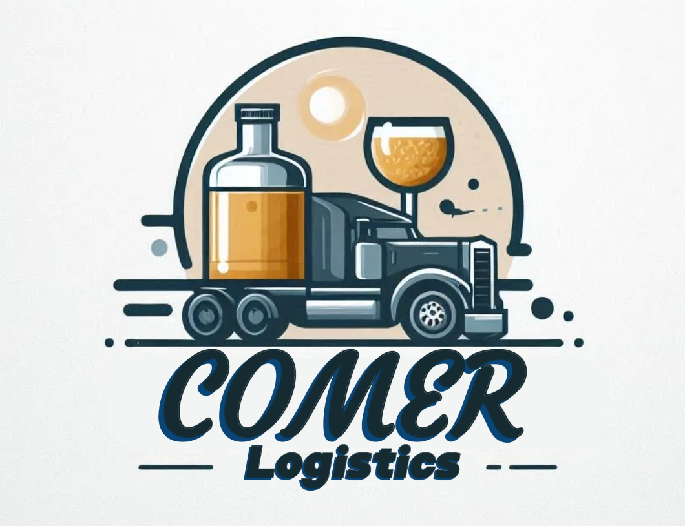
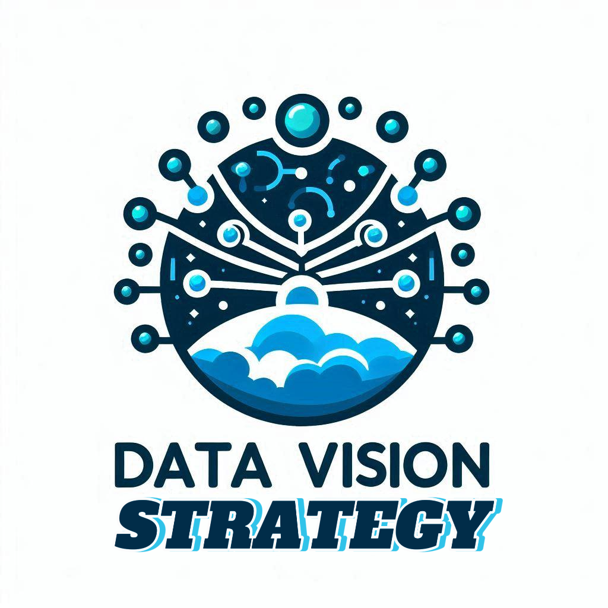
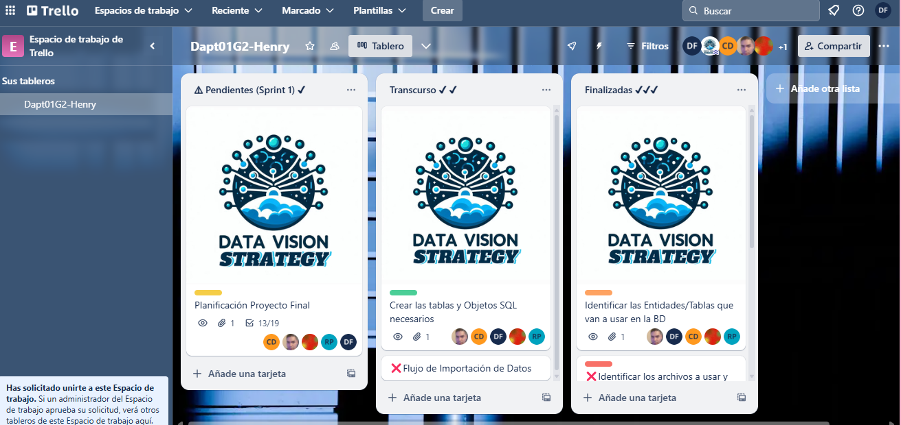

# 🚀**Proyecto Final Grupal (Henry / Data Analytics)** 🚀

 
#  **
"Optimización Integral de Inventarios y Gestión de Costos para el Comercio y Distribución"
** 

##  ✅CONSULTORA: 📈 **Data Vision Strategy** 📈

## ✅ Integrantes del equipo:

* 👨‍💻**Dussan Rivera, Carlos Fernando - Data Analytics** 

* 👨‍💻**Forti Ruiz, Daniela Maria - Data Analytics** 

* 👨‍💻**López, Marcelo Fabián - Data Analytics** 

* 👨‍💻**Pared, Ruben Hernan - Data Analytics** 

* 👨‍💻**Roman, Hernan Rufino - Data Analytics** 

## ✅ Video Introductorio :

##  📋 *Industria y contexto del caso de negocio a desarrollar:*📋

##  ✅ *EMPRESA:* **ComerLogistics**

🥂🍻🍹 **“ComerLogistics” es un comercio del sector de distribución y venta de bebidas alcohólicas. Este rubro se dedica a la compra, almacenamiento, y venta de una amplia variedad de licores, incluyendo vinos, cervezas, destilados y otras bebidas alcohólicas. La empresa se encarga de gestionar tanto las adquisiciones de productos de distintos proveedores como la distribución y venta a consumidores finales o negocios minoristas.** 🥂🍻🍹

##  ✅🔨 * Resumen descriptivo del Proyecto:* 🔨

* 🚀 **Desafío:**  🕵️‍♂🕵
**ComerLogistics**, una empresa líder en el sector de bebidas, se enfrentaba a desafíos críticos relacionados con la gestión de inventarios, los costos de compras y ventas. La eficiencia operativa y la toma de decisiones informadas son esenciales para su éxito continuo.

* 🚀**Solución:** 🕵️‍♂🕵
**Data Vision Strategy**, una **consultora especializada** en análisis de datos, fue contratada para abordar estos desafíos. A través de un enfoque meticuloso, identificamos áreas clave de mejora en la gestión de inventarios. Utilizamos técnicas avanzadas de análisis de datos para diseñar soluciones personalizadas.

* 🚀**Resultados esperados:** 🕵️‍♂🕵
Las soluciones implementadas no solo mejoraran la eficiencia en la gestión de inventarios, sino que también reduciran  significativamente los costos operativos. Para que asi **ComerLogistics** se convierta a corto plazo en una empresa más ágil y rentable.

##  ✅🚀 **PROPUESTA y OBJETIVOS de Data Vision Strategy** :🚀

##  ✅🎯*Objetivos* 🎯

⭕ **Mejorar la eficiencia en la gestión de inventarios.**
⭕ **Minimizar los costos operativos.**
⭕ **Optimizar el ciclo de rotación de inventarios.**
⭕ **Detectar patrones y tendencias en la venta de productos.**
⭕ **Ofrecer insights clave para la toma de decisiones estratégicas.**
⭕ **Predecir y Gestionar Costos**
⭕ **Centralizar la Información: Integrar los diferentes conjuntos de datos en una única plataforma**
.

## ✅*Resultados Esperados*🚀

⭕**Reducción de Costos Operativos**: Optimización del inventario y planificación de compras.

⭕**Incremento en la Eficiencia Operativa**: Automatización de procesos y visibilidad centralizada de datos.

⭕**Mejora en la Toma de Decisiones**: Análisis predictivo e identificación de tendencias.

⭕**Incremento en Ventas y Rentabilidad**: Optimización de ventas y mejora en la relación con proveedores.

## ✅*Impacto en el Sector* 🚀

⭕**Mayor Competitividad**: Mejor posicionamiento estratégico e innovación en la gestión de inventarios.

⭕**Sostenibilidad y Responsabilidad**: Reducción de desperdicios y optimización de recursos.

⭕**Mejora en la Toma de Decisiones Estratégicas**: Datos como activo estratégico y capacidad de respuesta rápida.

## ✅🧰 **Fuente de los Datos** : 🧰✅

⭕ 📋**Fuente Origen**: Kaggle:[Bases de Datos](https://www.kaggle.com/datasets/bhanupratapbiswas/inventory-analysis-case-study) 📋

⭕ 📋**Detalles del Dataset**: 📋

* **Inventario inicial**
*  **Inventario final**
* **Producto**
* **Compra**
* **Detalle de comprea**
* **Ventas**

## ✅**Trabajamos siguiendo el Cronograma de Trello:**

## ✅ **Diagrama Entidad Relacion:**

## ✅ **Detalles del repositorio:**

⭕ **DiagramaEntidadRelacion**
  
⭕ **SPRINT 1**

* [Conexion SQL/PYTHON](https://github.com/Dapt01G2-Henry/ComerLogistics/tree/be299b2f53546f7104b273e4f546a02a9e0b3559/Sprint_1/Conexion_SQL_Python)
* [DataSet](https://github.com/Dapt01G2-Henry/ComerLogistics/tree/be299b2f53546f7104b273e4f546a02a9e0b3559/Sprint_1/DataSet)
* [Diagrama_Entidad_Relacion](https://github.com/Dapt01G2-Henry/ComerLogistics/tree/be299b2f53546f7104b273e4f546a02a9e0b3559/Sprint_1/Diagrama_Entidad_Relacion)
* [EDA y ETL](https://github.com/Dapt01G2-Henry/ComerLogistics/tree/be299b2f53546f7104b273e4f546a02a9e0b3559/Sprint_1/EDA%20y%20ETL)

⭕ **SPRINT 2**

* [ComerLogistics.pbix](https://github.com/Dapt01G2-Henry/ComerLogistics/blob/be299b2f53546f7104b273e4f546a02a9e0b3559/Sprint_2/ComerLogistics.pbix)

⭕ * **Web_Scraping**
  
⭕* **Imagenes**

⭕ * **README.md**

## ✅ Herramientas Tecnológicas: 

 
 
 
 
 
 

 
 

    

  

